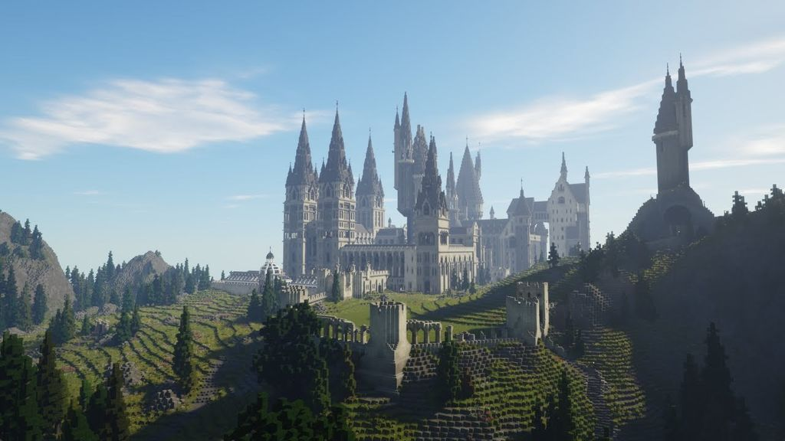

# Witchcraft-and-Wizardry-in-Spanish
  
This is a Spanish version of popular Minecraft map Witchcraft and Wizardry. Now this map is fully thanslated in Russian.  
Trailer:  

La traduccion oficial Española del mapa popular para Minecraft "Magia y Hechicería", sumergiendo un jugador en el universo de Harry Potter. la traduccion de Española no aporta nada y no elimina nada del juego. La traduccion está disponible para la version 1.16.3 del mapa.
Toda la información para la traduccion fue tomada de https://harrypotter.fandom.com/es/wiki/.
# Lista de cambios:  

Traducido:
> 1) Interfaz y todas las configuraciones;
> 2) títulos, descripciones y pasos de progreso de todas las misiones (todas ellas 69);       (CASI TERMINADO)
> 3) nombres y diálogos con todos los NPC (446 Personajes);          (EN PROGRESO)
> 4) Descripciones de ubicaciones (153 habitaciones y áreas);
> 5) Hechizos y sus descripciones (9); 
> 7) todas las cienamticas (aproximadamente 40);
> 8) Pueden existir errores y cambios de dialogos que surgen de la traducción.
  
  El total fue de ± 2000 archivos editados.
  

# Para apoyar el proyecto:
Se gastó mucho esfuerzo y tiempo en esta traducción, Para quienes quieran apoyar al proyecto de la traduccion:

[Paypal](https://www.paypal.me/BrunoTroisi)
